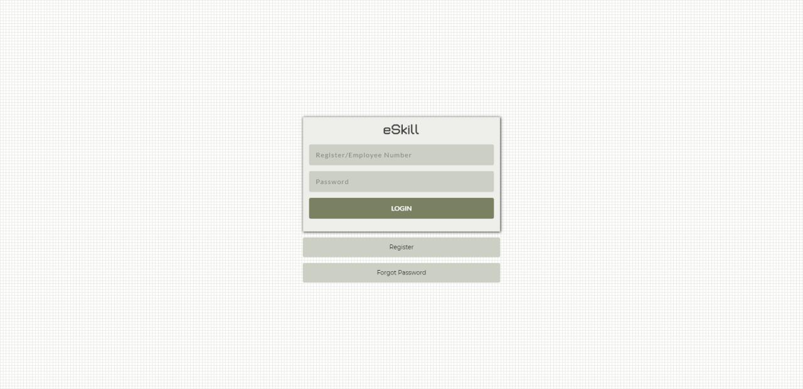
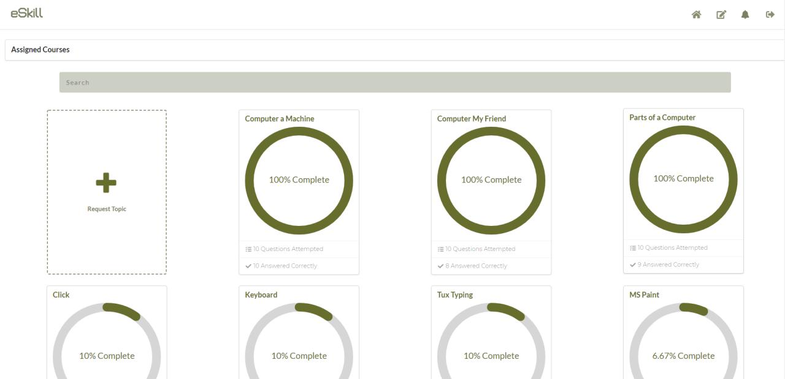
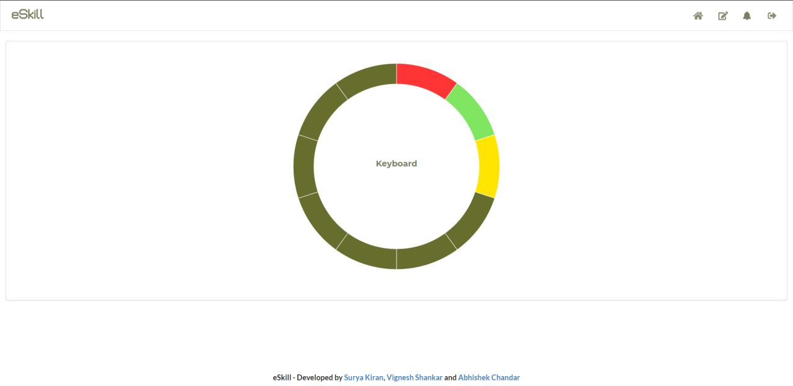
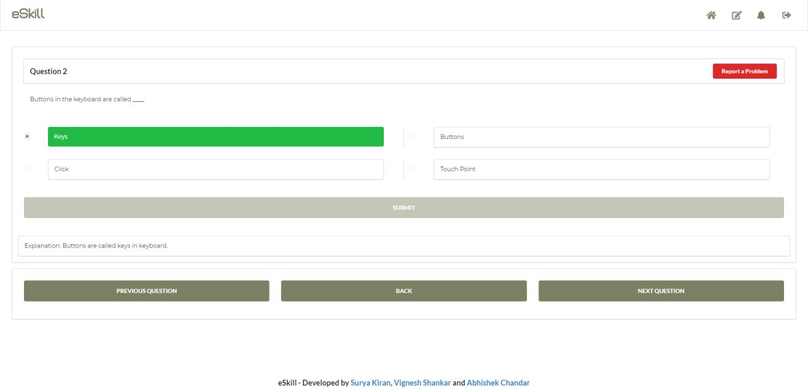

# School eSkill - A self evaluation and examination tool

eSkill is an online evaluation tool which is used for self-evaluation and improving the skills on various competitive examinations, academic curriculum and conduct exams. This tool will help the users to improve their skills by taking a number of mock tests to understand the dynamics of the test itself which will allow the candidate to perform better in the actual competitive examination.









# Getting Started

Run the following commands in order after cloning the repo

`sudo npm i -g yarn serve pm2`

`run yarn in directory`

`sudo apt install redis-server`

`yarn build`

We will now serve the dist folder created by yarn build command

Inside eskill directory create serve.sh using vim (ie)
vim serve.sh
contents are : `serve -s dist -l 1234`
If serve doesnt work, use npm package http-server

contents: http-server dist -a localhost -p 1234

`pm2 start serve
pm2 start server.js`

"pm2 logs server" for logs

Edit the conf file in /etc/nginx/sites-available/default
Replace the contents from location:

```location / {
proxy_pass http://localhost:1234;
proxy_http_version 1.1;
proxy_set_header Upgrade $http_upgrade;
proxy_set_header Connection 'upgrade';
proxy_set_header Host $host;
proxy_cache_bypass $http_upgrade;}

location /api/ {
proxy_pass http://localhost:5000;
proxy_http_version 1.1;
proxy_set_header Upgrade $http_upgrade;
proxy_set_header Connection 'upgrade';
proxy_set_header Host $host;
proxy_cache_bypass $http_upgrade;}

location /socket.io/ {
proxy_pass http://localhost:5000;
proxy_http_version 1.1;
proxy_set_header Upgrade $http_upgrade;
proxy_set_header Connection 'upgrade';
proxy_set_header Host $host;
proxy_cache_bypass $http_upgrade;}```


`sudo systemctl restart nginx`
